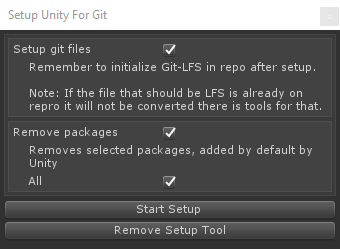

# Unity Project Template

There is nice little Unity Package in [Releases](https://github.com/StewMcc/Unity-Template/releases) that sets up default git settings, and Unity editor settings, as well as removing packages on mass. It works with Unity 2017.4 and later. 

Drag and drop the Unity package into your project. Open the utility window `Tools -> Setup Unity for Git` this will give you options for setting stuff up, and allow you to remove the tool afterwards.

 - Setup git files: Creates .gitattributes, & .gitignore for use with Unity, sets editor to force text, and visible meta files
 - Removes packages: Removes Unitys default packages ads, analytics etc.
 
### Notes:
- Prefer using the package over forking, as makes sure you don't end up with random settings from older versions kept in your editor settings polluting your commits at later dates when they change or get update.

- The package doesn't handle setting up the Git repository itself or setting up Git-LFS in the repository remember to initialize Git-LFS to use the .gitattributes file fully.

